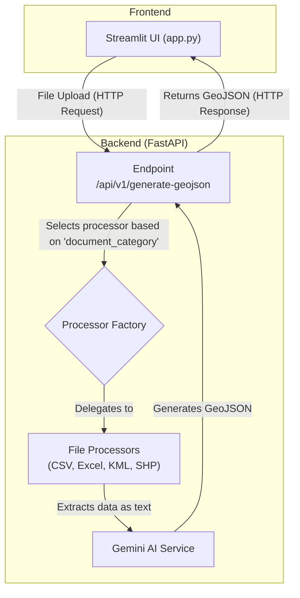
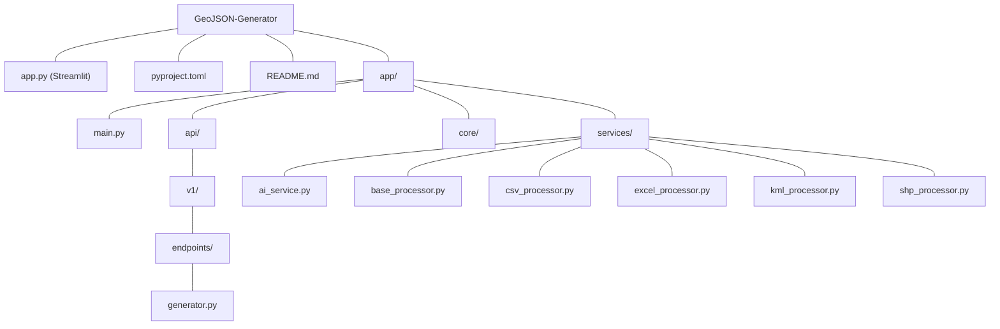

# GeoJSON Generator

This project is a FastAPI backend that converts various file formats (CSV, Excel, KML, KMZ, SHP) into GeoJSON format using Google's Gemini AI. It also includes a Streamlit frontend for easy interaction and testing.

## Features

- **Multiple File Support:** Process `CSV`, `XLSX` (Excel), `KML`, `KMZ`, and zipped `SHP` files.
- **AI-Powered Conversion:** Utilizes the Gemini Flash model to intelligently generate GeoJSON from extracted data.
- **Modular Architecture:** A clean, service-based architecture with dedicated processors for each file type.
- **RESTful API:** A robust FastAPI endpoint for programmatic access.
- **Interactive UI:** A simple Streamlit application for uploading files and viewing results.

## Architecture

The application is divided into a backend API and a frontend UI. The backend handles the file processing logic, while the frontend provides a user-friendly interface.



## Folder Structure



## Setup and Installation

1.  **Clone the repository:**
    ```bash
    git clone <repository-url>
    cd GeoJSON-Generator
    ```

2.  **Install Python dependencies:**
    This project uses `uv` for package management.
    ```bash
    uv sync
    ```

3.  **Set up environment variables:**
    Create a `.env` file in the root directory and add your Google API key:
    ```
    GOOGLE_API_KEY="your_api_key_here"
    ```

## How to Run

1.  **Start the FastAPI Backend:**
    ```bash
    uvicorn app.main:app --reload
    ```
    The API will be available at `http://127.0.0.1:8000`.

2.  **Run the Streamlit Frontend:**
    ```bash
    streamlit run app.py
    ```
    The Streamlit app will be available at the URL provided in your terminal (usually `http://localhost:8501`).

## API Endpoint

### Generate GeoJSON

-   **URL:** `/api/v1/generate-geojson`
-   **Method:** `POST`
-   **Multipart Form Data:**
    -   `file`: The file to be processed.
    -   `document_category` (string): The type of the document. Supported values are `csv`, `xlsx`, `kml`, `kmz`, `shp`.
